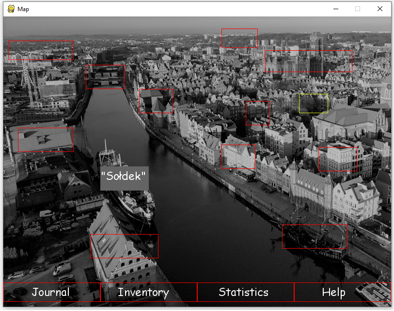
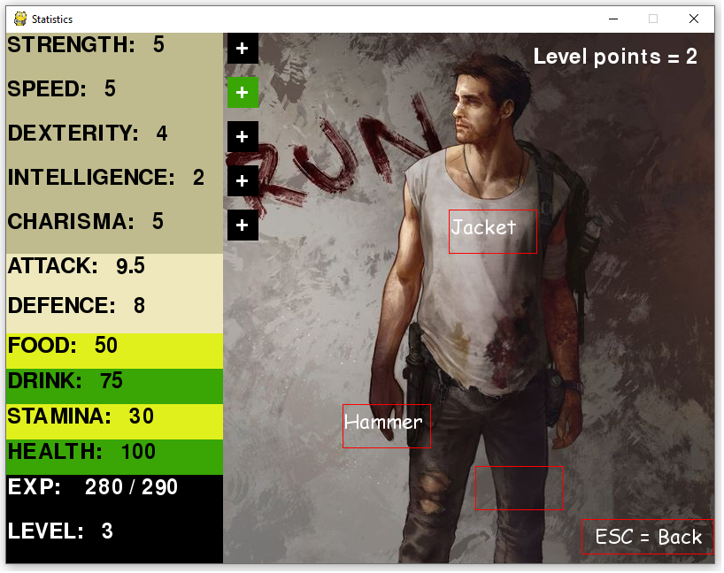
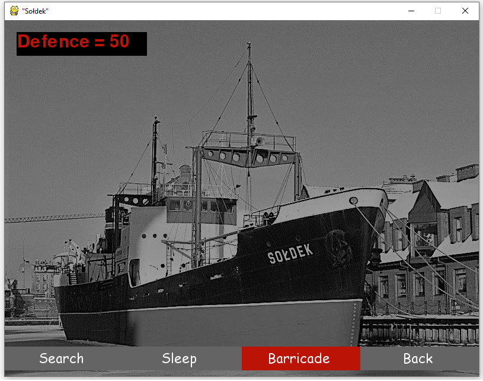

# PygameProject

This is my first biggest project in Python. To build the game I used Pygame library. It's a simple point & click survival game, which I started to improve my Python skills.

Goal of the game is to open a special Gate - you can do this by different approaches. You need to take care of food, water and stamina.

